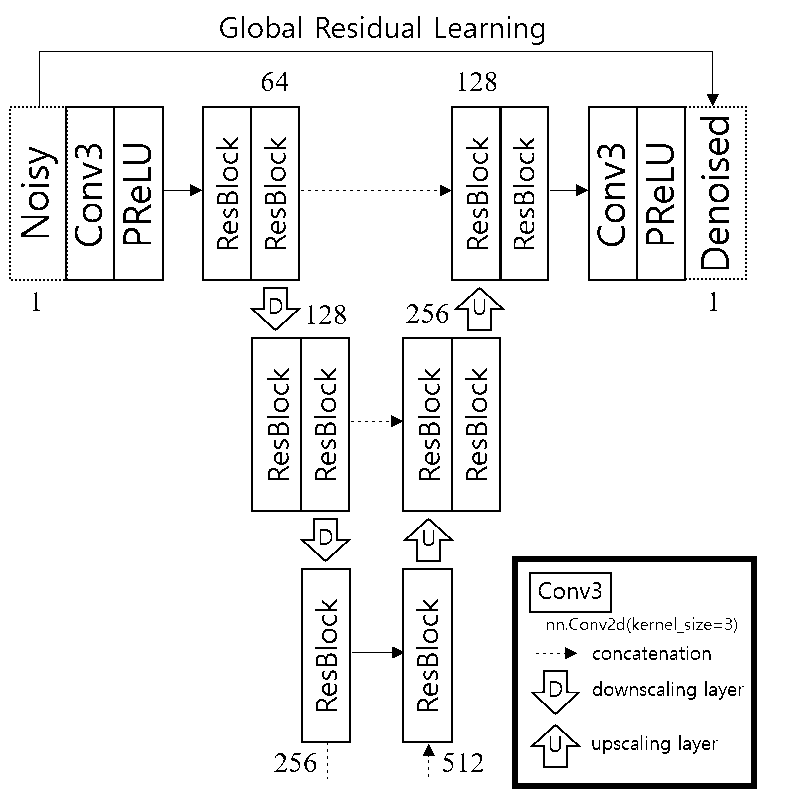

# RUN
This is a PyTorch implementation of the [32nd Workshop on Image Processing and Image Understanding (IPIU 2020)](http://www.ipiu.or.kr/2020/index.php) paper, Residual U-shaped Network for Image Denoising.

If you find our project useful in your research, please consider citing:
~~~
@inproceedings{kim2019run,
  title={Residual U-shaped Network for Image Denoising},
  author={Kim, Sangmin and Park, Bumjun and Jeong, Jechang},
  booktitle={32nd Workshop on Image Processing and Image Understanding (IPIU 2020)},
  year={2020}
~~~

# Dependencies
Python 3.6  
PyTorch 1.4.0

# Data
We used the [DIV2K datasets](https://data.vision.ee.ethz.ch/cvl/DIV2K/) for training the proposed network.  
Furthermore, the datasets for testing the proposed network are BSD68 datasets and Set12 datasets that were used in DnCNN.

# Proposed algorithm

