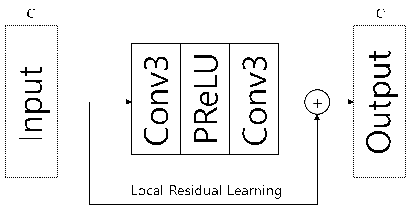
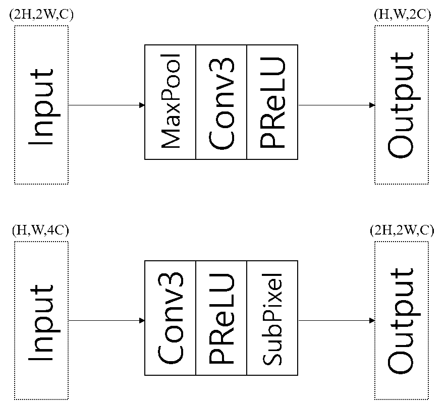
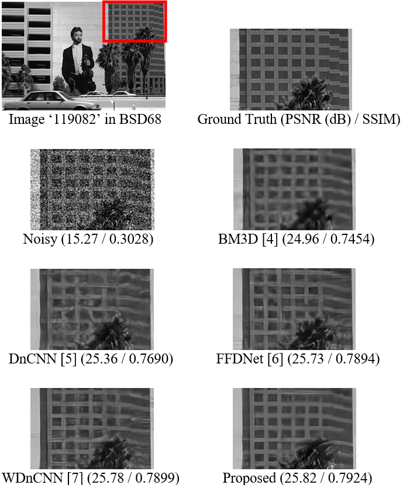
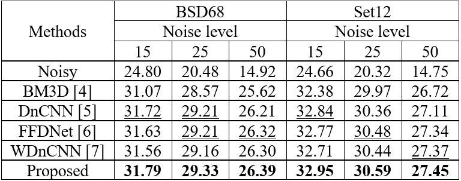
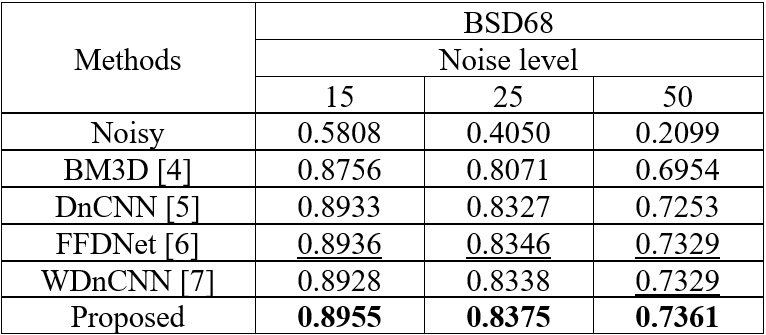
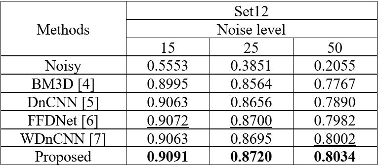

# RUN
This is a PyTorch implementation of the [32nd Workshop on Image Processing and Image Understanding (IPIU 2020)](http://www.ipiu.or.kr/2020/index.php) paper, [Residual U-shaped Network for Image Denoising](IPIU_RUN.pdf).

If you find our project useful in your research, please consider citing:
~~~
@inproceedings{kim2019run,
  title={Residual U-shaped Network for Image Denoising},
  author={Kim, Sangmin and Park, Bumjun and Jeong, Jechang},
  booktitle={32nd Workshop on Image Processing and Image Understanding (IPIU 2020)},
  year={2020}
~~~

# Dependencies
Python 3.6  
PyTorch 1.4.0

# Data
We used the [DIV2K datasets](https://data.vision.ee.ethz.ch/cvl/DIV2K/) for training the proposed network.  
Furthermore, the datasets for testing the proposed network are  
BSD68 datasets and Set12 datasets that were used in DnCNN.  
There are other options you can choose.  
Please refer to dataset.py.  

# Proposed algorithm

# Training
Use the following command to use our training codes
~~~
python train.py
~~~
There are other options you can choose.
Please refer to train.py.

# Test
Use the following command to use our test codes
~~~
python test.py
~~~
There are other options you can choose.
Please refer to test.py.

# Results

# Contact
If you have any question about the code or paper, feel free to ask me to <ksmh1652@gmail.com>.

# Acknowledgement
Thanks for [SaoYan](https://github.com/SaoYan/DnCNN-PyTorch) who gave the implementaion of DnCNN.

This work was supported by the BK21 PLUS(Brain Korea 21 Program for Leading Universities & Students) funded by the Ministry of Education, Korea. (H0301-14-1018)
